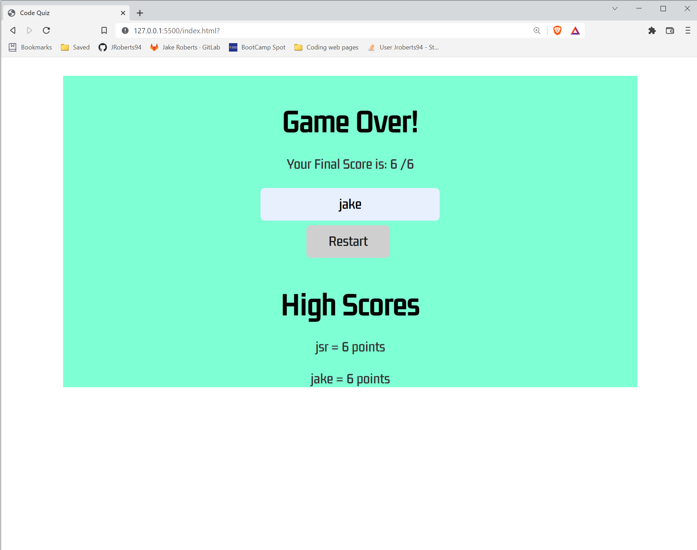

# Week 04: Code Quiz

## Your Task

this weeks homework assignment was to create a code quiz from scratch.
with functioning UI.
i have made a quiz containing 6 question, with a save feature, with a score and scoreboard and with a 60 second timer of which selecting an incorrect answer deducts 10 seconds from the time.


## User Story

```
AS A coding boot camp student
I WANT to take a timed quiz on JavaScript fundamentals that stores high scores
SO THAT I can gauge my progress compared to my peers
```

## Acceptance Criteria

```
GIVEN I am taking a code quiz
WHEN I click the start button
THEN a timer starts and I am presented with a question
WHEN I answer a question
THEN I am presented with another question
WHEN I answer a question incorrectly
THEN time is subtracted from the clock
WHEN all questions are answered or the timer reaches 0
THEN the game is over
WHEN the game is over
THEN I can save my initials and my score
```

## Technology Used
HTML
CSS
JavaScript


## Links
* [Link to deployed Website](https://jroberts94.github.io/week4-code-quiz/)
* [Link to github Repository](https://github.com/JRoberts94/week4-code-quiz)
* 


